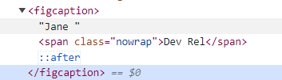

### Main principles:
Design from small screens to larger when using media queries.

### Pseudo classes
:is() is a pseudo selector. It changes specificity accordingly to what is passed inside. It can be useful to not repeat like:

nav a:hover, nav a:focus 
-->
nav :is(a:hover, a:focus) {
  color: hsla(0, 0%, 20%, 0.6);
}

:where() is almost the same, but has 0 specificity. Anything will override it.

:target is for element that is selected, for example with page link (a href="#profile1").

img[alt] {} - selector for every  element that has "alt" attribute.
img:not([alt]) - the opposite.

pseudo class ':not' can be used in many places, not only here. 

:nth-child() selector is based on *original* order of html elements. If they are reordered with CSS, it will look not as expected.

### Pseudo element
It creates an element and adds it to existing elements.

.card figcaption::after {
	content: '🐧';
}
-->
<::after></::after> elements appear in html, but in the inspect tab they are not observable properly. 

Pseudo elements allow to add some content and/or style it separately from the original HTML content.
For example one can add quotes and make them bigger, with padding and change position.

### Common Media Query breakpoints:
| Breakpoint | Description |
| -------- | ---------- |
| < 481px | Mobile devices |
| 481px — 768px | iPads, Tablets |
| 769px — 1024px | Small screens, laptops |
| 1025px — 1200px | Desktops, large screens |
| 1201px and greater | Extra large screens, TV |

### Bootstrap breakpoints:
| Breakpoint | Description |
| -------- | ---------- |
| < 576px | xs |
| >=576px | small |
| >=768px | medium |
| >=992px | large |
| >=1200px | xl |
| >=1400px | 2xl |

### Tailwind breakpoints:
| Breakpoint | Description |
| -------- | ---------- |
| < 640px | xs |
| >=640px | small |
| >=768px | medium |
| >=1024px | large |
| >=1280px | xl |
| >=1536px | 2xl |